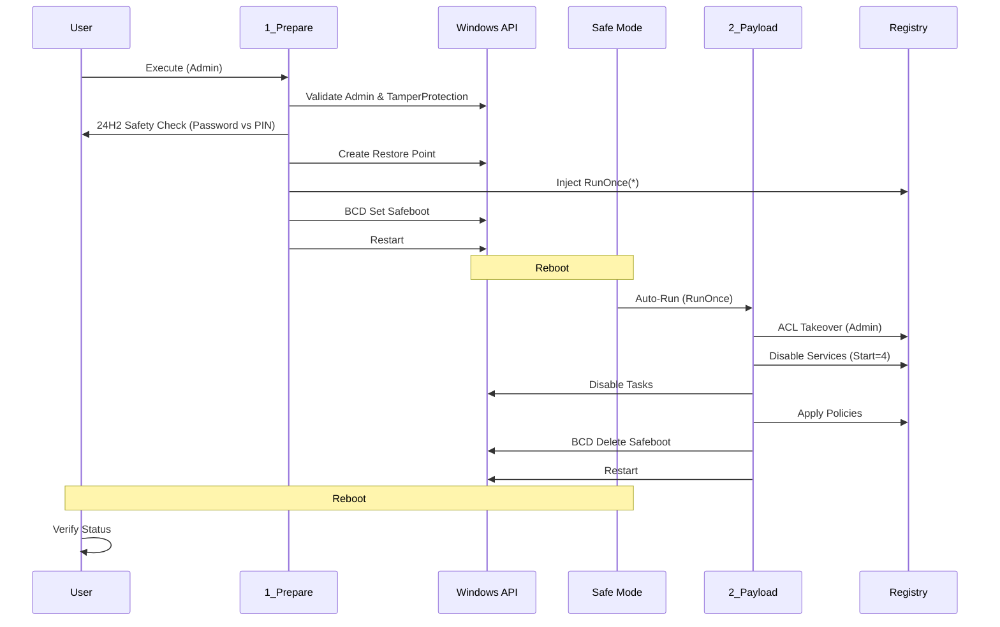

# killSlop

**killSlop** is a PowerShell automation suite designed to neutralize Microsoft Defender services and drivers on Windows 11 systems. It employs a Safe Mode Registry Injection vector with automatic ACL (Access Control List) modification to disable protected kernel-level components.

## Architecture

The protocol follows a linear execution path involving a reboot cycle to bypass kernel protections.

## Prerequisites

1.  **Tamper Protection Disabled:** Must be turned off manually in *Windows Security > Virus & threat protection > Manage settings*.
2.  **Microsoft Account Password:** Required for Safe Mode login if Windows Hello PIN is unavailable (Windows 11 24H2 constraint).
3.  **Administrator Privileges:** Required for all scripts.

## Usage

1.  **Preparation:**
    Run `1_prepare_safemode.ps1` with PowerShell (Admin).
    Confirm safety checks when prompted.

2.  **Execution (Automated):**
    The system will reboot into Safe Mode with Networking.
    The payload (`2_kill_defender.ps1`) will execute automatically.
    The system will reboot back to normal mode.

3.  **Verification:**
    Run `3_verify_status.ps1` to inspect service states and logs.
    Logs are stored at `C:\DefenderKill\killSlop_log.txt`.

## Operational Impact (SOTA Analysis)

Disabling kernel-level security modules has distinct side effects. This protocol is designed to minimize instability, but users must be aware of the following 2026-era consequences:

| Component | Status | Impact Analysis |
| :--- | :--- | :--- |
| **Windows Update** | [Partial] | Core OS updates will continue. Updates specific to Defender (Intelligence/Engine) will fail. |
| **Microsoft Store** | [Stable] | Store Apps generally function. Some banking/enterprise apps requiring "Device Health Attestation" may refuse to run. |
| **Network Stack** | [Optimized] | `WdNisDrv` (Network Inspection) removal eliminates packet inspection overhead. No known stack breakage in 24H2. |
| **System Stability** | [Low Risk] | Removing `WdFilter.sys` prevents minifilter conflicts (`sprotect.sys`), potentially *reducing* BSODs on specific NVMe hardware. |
| **Security Center** | [Disabled] | The UI will report "Unknown" or be inaccessible. Notifications will cease. |

## Disclaimer

This software disables critical security features. It is intended for specialized environments (e.g., benchmark rigs, offline compute nodes) where background interference must be eliminated. Use at your own risk.
